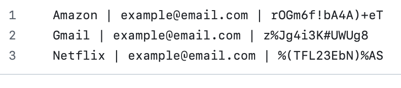

# Password Manager (Python and Tkinter)

A desktop **Password Manager** application built with Python and Tkinter.  
The application allows users to generate strong random passwords, store credentials locally, and automatically copy passwords to the clipboard for quick use.

---

## Features

- Generate secure random passwords using:
  - Uppercase & lowercase letters
  - Numbers
  - Symbols
- One-click password copy to clipboard
- User-friendly graphical interface (Tkinter)
- Save credentials locally to a text file
- Input validation and confirmation dialogs
- Python fundamentals and clean code practices

---

## 📸 Screenshots

### Main Application Interface


### File with Saved Credentials


---

## Technical Concepts

- **Python 3**
  - Core language features including functions, conditionals, loops, and list comprehensions

- **Tkinter (GUI Development)**
  - Built a user-friendly desktop interface using `Tk`, `Label`, `Entry`, `Button`, and `Canvas`
  - Implemented event-driven programming with button commands and user interactions
  - Applied basic layout management using the grid system

- **Random Module (Password Generation Logic)**
  - Generated secure, randomized passwords using letters, numbers, and symbols using `random.choice`, `random.shuffle`, and `randint`

- **Pyperclip**
  - Automatically copied generated passwords to the system clipboard

- **File Handling**
  - Stored user credentials locally using file I/O operations
  - Appended data without overwriting existing entries

- **Input Validation & Error Handling**
- - Prevented empty field submissions
  - Used dialog boxes to confirm user actions and display errors


---

## How to Run the Project

1. Clone the repository:
```bash
git clone https://github.com/your-username/password-manager.git
```

2. Install required dependencies:
```bash
pip install pyperclip
```

3. Run the application:
```bash
python main.py
```
